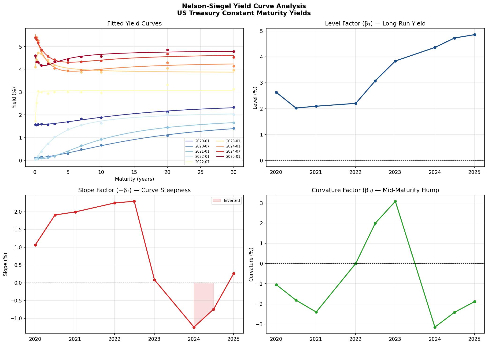

# Yield Curve Fitting — Nelson-Siegel Model

Fits the Nelson-Siegel parametric model to US Treasury constant-maturity yields, extracts the three latent factors (level, slope, curvature), and tracks their evolution across rate cycles from 2020 to 2025.



## What this project does

The Nelson-Siegel model decomposes the yield curve into three economically interpretable factors:

| Factor | Parameter | Interpretation |
|--------|-----------|---------------|
| **Level** (β₁) | Long-run yield | Shifts the entire curve up or down |
| **Slope** (β₂) | Short vs long-end difference | Negative = inverted curve (recession signal) |
| **Curvature** (β₃) | Mid-maturity hump | Captures belly of the curve |

The model fits observed yields via non-linear least squares optimisation, minimising the sum of squared errors across 11 maturities (1M to 30Y). Median RMSE across all dates: **4.7 basis points** — well within typical bid-ask spreads.

## Key findings

- Curve inverted most sharply in **January 2024** (slope = −1.25%), consistent with the most aggressive Fed tightening cycle in 40 years
- GARCH-like persistence in the level factor — long-run yields mean-reverted slowly from the 2020 near-zero regime
- Curvature factor turned negative during the 2024 inversion, reflecting market expectations of eventual rate cuts

## How to run

```bash
pip install -r requirements.txt
python yield_curve.py
```

Output: `yield_curve_analysis.png` with 4 panels — fitted curves, level, slope, and curvature factors.

## Data

Hardcoded US Treasury constant-maturity yield snapshots (FRED). To use live data, replace `load_sample_treasury_data()` with a FRED API call:

```python
import pandas_datareader as pdr
tickers = ["DGS1MO","DGS3MO","DGS6MO","DGS1","DGS2","DGS3","DGS5","DGS7","DGS10","DGS20","DGS30"]
df = pdr.get_data_fred(tickers, start="2020-01-01")
```

## Extensions

- Svensson model (adds β₄ for second hump — used by ECB and Bundesbank)
- Dynamic Nelson-Siegel with VAR(1) factor dynamics for forecasting
- Principal Component Analysis comparison (empirical vs parametric)
